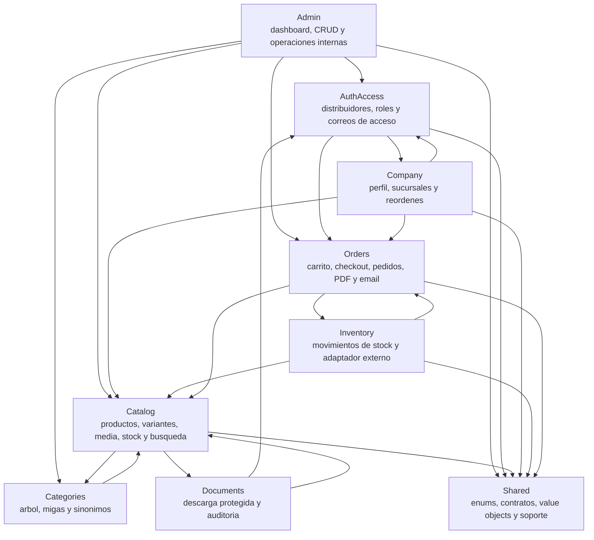
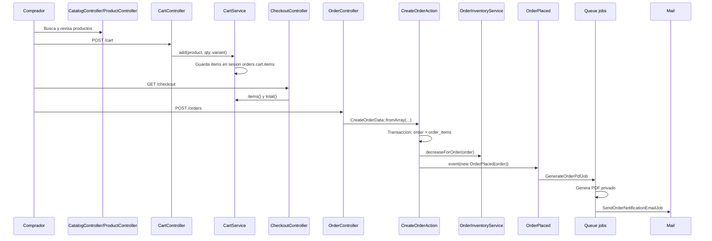
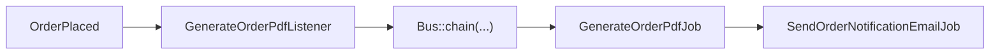

# Architecture

Guia corta para que un desarrollador nuevo entienda el sistema en unos 30
minutos. Para instalacion, despliegue o API HTTP generada, usa las guias
dedicadas enlazadas al final.

## Tabla de contenidos

1. [Resumen del sistema](#resumen-del-sistema)
2. [Mapa de modulos](#mapa-de-modulos)
3. [Flujo principal de pedido](#flujo-principal-de-pedido)
4. [Eventos y colas](#eventos-y-colas)
5. [Patrones de codigo](#patrones-de-codigo)
6. [Decisiones clave](#decisiones-clave)
7. [Referencias](#referencias)

## Resumen del sistema

El portal es un monolito modular Laravel 12 para catalogo, carrito, pedidos,
documentos de producto, administracion y autoservicio de distribuidores.

- Backend: Laravel 12, PHP 8.3, Eloquent, Policies, Form Requests y colas de Laravel.
- Frontend: Blade, Tailwind, Alpine y Vite.
- Base de datos principal: PostgreSQL.
- PDFs: DomPDF mediante `barryvdh/laravel-dompdf`.
- Correos: Mailables de Laravel, enviados desde jobs.
- Documentacion HTTP: Scribe, descrita en `docs/documentacion-api.md`.
- Dominio: organizado por carpetas bajo `app/Modules`.

Las rutas principales entran por `routes/web.php`, que carga `routes/admin.php`,
`routes/company.php` y `routes/auth.php`.

## Mapa de modulos

Los modulos no son microservicios. Comparten aplicacion, base de datos,
autenticacion, colas y despliegue. Las flechas muestran dependencias de codigo
relevantes entre dominios.



### Responsabilidades rapidas

- [`Admin`](app/Modules/Admin/README.md): panel interno. Orquesta catalogo, categorias, distribuidores, usuarios,
  pedidos e inventario, pero no debe duplicar reglas de dominio.
- [`AuthAccess`](app/Modules/AuthAccess/README.md): modelo de distribuidor, middleware de roles y correos de acceso.
- [`Catalog`](app/Modules/Catalog/README.md): productos, variantes, fotos, documentos, videos, importacion,
  busqueda y stock editable.
- [`Categories`](app/Modules/Categories/README.md): arbol de categorias, descendientes, breadcrumbs y sinonimos.
- [`Company`](app/Modules/Company/README.md): autoservicio de distribuidor: perfil, sucursales, pedidos y reorden.
- [`Documents`](app/Modules/Documents/README.md): descargas protegidas de documentos de producto y registro de uso.
- [`Inventory`](app/Modules/Inventory/README.md): movimientos de stock y contrato/adaptador para sincronizacion
  externa.
- [`Orders`](app/Modules/Orders/README.md): carrito, checkout, creacion/edicion de pedidos, estados, PDF y emails.
- [`Shared`](app/Modules/Shared/README.md): tipos compartidos de bajo nivel: enums, contratos, value objects,
  excepciones y helpers.

## Flujo principal de pedido

El flujo normal hoy no requiere aprobacion interna. `User::orderRequiresApproval()`
y `User::canApproveOrders()` retornan `false`; hay codigo historico de aprobacion,
pero no forma parte del recorrido principal.



Puntos importantes:

- El carrito vive en sesion mediante `Orders\Services\Cart\CartService`.
- `CreateOrderAction` valida productos/variantes activos, crea snapshots de linea
  y descuenta inventario cuando el pedido queda `submitted`.
- `OrderInventoryService` usa `lockForUpdate()` y registra cambios con
  `StockMovement`.
- El PDF se guarda en disco privado mediante `OrderPdfGenerator`.
- Las descargas de PDF del pedido pueden regenerar el archivo si falta.

## Eventos y colas

El unico listener registrado para pedidos nuevos esta en
`app/Providers/EventServiceProvider.php`:

```text
OrderPlaced -> GenerateOrderPdfListener
```

El listener no envia email directamente y no existe un
`SendOrderNotificationEmailListener`. El flujo real es:



La cadena garantiza que el email se procese despues de generar el PDF. Si el job
de PDF agota sus reintentos, el job de email no continua dentro de esa cadena.

Otros flujos, como ediciones de pedidos en admin o empresa, pueden despachar
`GenerateOrderPdfJob` directamente para regenerar el PDF luego de invalidarlo.

## Patrones de codigo

- Actions: casos de uso con reglas de dominio y transacciones. Ejemplos:
  `Catalog\Actions\CreateProductAction`, `Orders\Actions\CreateOrderAction`.
- Services: logica reutilizable o integracion de infraestructura. Ejemplos:
  `Orders\Services\OrderPdfGenerator`, `Catalog\Services\ProductStockService`.
- Jobs: trabajo asincrono en cola. Ejemplos:
  `Orders\Jobs\GenerateOrderPdfJob`, `Orders\Jobs\SendOrderNotificationEmailJob`.
- DTOs: datos tipados entre controlador y dominio. Ejemplo:
  `Orders\DTOs\CreateOrderData`.
- Enums: estados y valores cerrados compartidos. Ejemplos:
  `Shared\Enums\OrderStatus`, `Shared\Enums\DocumentType`.
- Queries: consultas con reglas de lectura/ranking. Ejemplos:
  `Catalog\Queries\PostgresSearchEngine`, `Categories\Queries\CategoryTreeQuery`.
- Policies y Gates: autorizacion por modelo o capacidad. Las policies viven en
  cada modulo; gates transversales se registran en `AppServiceProvider`.
- Form Requests: validacion y normalizacion de entrada bajo
  `app/Modules/*/Http/Requests`.
- Contracts: abstracciones compartidas para bindings del contenedor. Ejemplos:
  `SearchEngineInterface`, `InventorySyncInterface`.
- Value Objects: estructuras pequenas sin persistencia, bajo `Shared\ValueObjects`.
- Mailables: plantillas de correo por dominio, por ejemplo `Orders\Mail`.

## Decisiones clave

### Monolito modular, no microservicios

El sistema mantiene una sola aplicacion Laravel y una sola base de datos. Esto
reduce complejidad operacional, evita contratos de red innecesarios y permite
transacciones directas para flujos como pedido, inventario y PDF. Los limites de
dominio se expresan en `app/Modules`, no en despliegues separados.

### Busqueda con PostgreSQL y ranking local

`PostgresSearchEngine` usa PostgreSQL para prefiltrar candidatos con expresiones
`unaccent(lower(...))` cuando el driver es `pgsql`. El ranking fino se hace en
PHP con pesos por nombre, marca, categoria, sinonimos y descripcion. En tests con
SQLite, el motor cae a `lower(...)` para mantener compatibilidad.

No es un motor externo tipo Elasticsearch ni una busqueda full-text dedicada. La
decision prioriza simplicidad operacional y control de ranking para el tamano
actual del catalogo.

### Inventario portal-owned/manual

El stock operativo vive en `products.stock` y `product_variants.stock`. El portal
lo valida, descuenta, restaura y audita con `StockMovement`. El contrato
`InventorySyncInterface` y `ContaPymeInventoryService` existen como seam de
integracion, pero no reemplazan el flujo principal portal-owned/manual.

No documentes InvenTree como integracion activa en este checkout.

### PDFs privados y notificaciones asincronas

Los PDFs de pedidos se generan en disco privado y se adjuntan a correos desde
jobs. Esto evita bloquear el request de checkout y reduce el riesgo de exponer
documentos por rutas publicas.

### Admin y Company son superficies, no dominios duplicados

`Admin` y `Company` coordinan pantallas y permisos sobre modelos de otros
modulos. Las reglas principales deben vivir en Actions, Services, Policies,
Enums o Queries del dominio correspondiente.

### Aprobaciones de empresa estan inactivas

Hay clases relacionadas con aprobacion interna de empresa, pero las rutas no
estan expuestas en el panel actual y `User::canApproveOrders()` /
`User::orderRequiresApproval()` retornan `false`. Para onboarding, tratalo como
codigo historico/inactivo hasta que una decision de producto lo reactive.

## Referencias

- `README.md`: instalacion, entorno local, operacion y despliegue amplio.
- `CONTRIBUTING.md`: reglas para contribuir, comandos y estructura esperada.
- `docs/documentacion-api.md`: generacion y acceso a docs HTTP con Scribe.
- `CI_CD_SETUP.md`: pipeline, environments y troubleshooting de CI/CD.
- `DEPLOY.md`: guia operacional de despliegue.
- `REDIS_MIGRATION.md`: plan especifico para migracion de colas a Redis.
