# Modelo Relacional — Portal de Distribuidores

Esquema PostgreSQL del portal de Import Corporal Medical SAS.

- **37 tablas** (29 de dominio + 8 de infraestructura Laravel)
- **37 PRIMARY KEY**, **46 FOREIGN KEY**, **99 índices**
- **20 restricciones UNIQUE** además de las PK
- Extensión requerida: `unaccent` (usada por la búsqueda del catálogo)

La fuente de verdad son las 70 migraciones de `database/migrations/`.
[`schema.sql`](schema.sql) es el DDL consolidado resultante de aplicarlas todas
en orden, verificado cargándolo en una base vacía.

Los diagramas del sistema — ER por módulo, estados de pedido y pago, y la
cadena de documentos hacia R2 — están en [`diagramas.md`](diagramas.md).

## Tabla de contenidos

1. [Convenciones](#convenciones)
2. [Inventario de tablas](#inventario-de-tablas)
3. [Diagrama entidad-relación](#diagrama-entidad-relación)
4. [Llaves foráneas](#llaves-foráneas)
5. [Restricciones UNIQUE](#restricciones-unique)
6. [Índices](#índices)
7. [Decisiones de diseño](#decisiones-de-diseño)
8. [Regenerar este esquema](#regenerar-este-esquema)

## Convenciones

| Aspecto | Convención |
|---|---|
| Llave primaria | `id bigint GENERATED BY DEFAULT AS IDENTITY` (Laravel `bigIncrements`) en 36 de 37 tablas |
| Excepciones a la PK | `contapyme_sync_runs.id` es `uuid`; `cache`/`cache_locks` usan `key`; `password_reset_tokens` usa `email` |
| Timestamps | `created_at` / `updated_at` como `timestamp(0) without time zone`, nullables |
| Dinero | `numeric(12,2)` a nivel de línea, `numeric(14,2)` a nivel de total |
| Cantidades | `numeric(12,2)` — permite fraccionar unidades de venta |
| Umbrales de configuración | `integer` en pesos enteros (`silver_min_order_amount`, `gold_pricing_threshold_amount`) |
| Enumerados | `character varying` **sin** `CHECK`; se validan con PHP enums en `app/Modules/Shared/Enums/` |
| Nombres de FK | `<tabla>_<columna>_foreign` (generado por Laravel) |
| Datos históricos | columnas `*_snapshot` que congelan el valor al momento del pedido |

## Inventario de tablas

### Catálogo

| Tabla | PK | Descripción |
|---|---|---|
| `categories` | `id` | Árbol de categorías; `parent_id` auto-referencia |
| `category_synonyms` | `id` | Términos alternativos por categoría, usados en el ranking de búsqueda |
| `products` | `id` | Producto base: `sku` único, `price`, `stock`, `reserved_stock`, marcas de sincronización con ContaPyme |
| `product_attributes` | `id` | Eje de variación (ej. "Talla", "Color") |
| `product_attribute_values` | `id` | Valores concretos del eje (ej. "M", "Azul") |
| `product_variants` | `id` | Combinación producto × valor de atributo, con precio y stock propios |
| `product_photos` | `id` | Fotos, con bandera `is_primary` y dimensiones cacheadas |
| `product_documents` | `id` | Ficha técnica, manual, INVIMA, guía rápida, calibración — uno por `type` |
| `product_videos` | `id` | URLs de video asociadas al producto |
| `catalog_banners` | `id` | Banners del catálogo por `placement` |

### Empresas y acceso

| Tabla | PK | Descripción |
|---|---|---|
| `distributors` | `id` | Empresa distribuidora: NIT, contacto, `status`, `tier` (oro/plata) con auditoría de cambio |
| `users` | `id` | Cuentas de acceso; `role` (admin/distributor), `distributor_id` **único** |
| `company_branches` | `id` | Sucursales de la empresa, con una marcada `is_default` |
| `company_lists` | `id` | Listas de compra recurrentes del distribuidor |
| `company_list_items` | `id` | Ítems de la lista, con snapshots de nombre y SKU |

### Pedidos y comercio

| Tabla | PK | Descripción |
|---|---|---|
| `carts` | `id` | Carrito persistente — **uno por usuario**; `reminder_sent_at` para el recordatorio de abandono |
| `cart_items` | `id` | Líneas del carrito, identificadas por `line_key` (producto + variante) |
| `orders` | `id` | Pedido. 50 columnas: datos de la empresa, envío, pago manual y tres bloques de snapshot |
| `order_items` | `id` | Líneas del pedido con snapshots de nombre, SKU, variante, IVA y precios Oro/Plata |
| `order_status_histories` | `id` | Bitácora de transiciones de estado, con actor y `metadata` JSON |
| `payment_upload_tokens` | `id` | Tokens de un solo uso (hash SHA-256) para subir comprobante sin sesión |
| `commerce_pricing_rules` | `id` | Reglas de precios versionadas: markup Plata, redondeo, mínimos y umbral Oro |
| `commerce_tier_advisors` | `id` | Asesor comercial asignado por nivel — **una fila por `tier`** |

### Inventario

| Tabla | PK | Descripción |
|---|---|---|
| `inventory_holds` | `id` | Reserva de stock por pedido — fuente de auditoría del inventario comprometido |
| `inventory_hold_events` | `id` | Cada cambio de cantidad de un hold, con actor y motivo |
| `stock_movements` | `id` | Bitácora de movimientos de stock con `previous_stock` / `new_stock` / `delta` |
| `contapyme_inventory_mappings` | `id` | Mapeo producto/variante ↔ `irecurso` del ERP ContaPyme |
| `contapyme_sync_runs` | `id` (uuid) | Corrida de sincronización con métricas y diagnósticos JSON |

### Documentos

| Tabla | PK | Descripción |
|---|---|---|
| `document_downloads` | `id` | Registro de descargas para el cupo mensual por distribuidor |

### Infraestructura Laravel

`migrations`, `sessions`, `password_reset_tokens`, `cache`, `cache_locks`,
`jobs`, `job_batches`, `failed_jobs`.

`jobs` y `cache` no son decorativas: el portal usa el driver `database` tanto
para colas como para caché y locks.

## Diagrama entidad-relación

```mermaid
erDiagram
    distributors ||--o| users : "1:1 users.distributor_id UNIQUE"
    distributors ||--o{ company_branches : tiene
    distributors ||--o{ company_lists : tiene
    distributors ||--o{ orders : coloca
    distributors ||--o{ document_downloads : "consume cupo"
    users ||--o| carts : "1:1"
    users ||--o{ orders : crea

    categories ||--o{ categories : parent_id
    categories ||--o{ category_synonyms : sinonimos
    categories ||--o{ products : clasifica

    product_attributes ||--o{ product_attribute_values : valores
    product_attributes ||--o{ products : variant_attribute_id
    products ||--o{ product_variants : variantes
    product_attribute_values ||--o{ product_variants : valor
    products ||--o{ product_photos : fotos
    products ||--o{ product_documents : documentos
    products ||--o{ product_videos : videos
    product_documents ||--o{ document_downloads : descargas

    carts ||--o{ cart_items : lineas
    products ||--o{ cart_items : referencia
    product_variants ||--o{ cart_items : referencia

    company_lists ||--o{ company_list_items : items
    products ||--o{ company_list_items : referencia

    orders ||--o{ order_items : lineas
    orders ||--o{ order_status_histories : bitacora
    orders ||--o{ payment_upload_tokens : tokens
    orders ||--o{ inventory_holds : reserva
    orders ||--o{ inventory_hold_events : eventos
    orders ||--o{ stock_movements : movimientos
    commerce_pricing_rules ||--o{ orders : "reglas vigentes"
    products ||--o{ order_items : referencia
    product_variants ||--o{ order_items : referencia

    inventory_holds ||--o{ inventory_hold_events : eventos
    products ||--o{ inventory_holds : reserva
    product_variants ||--o{ inventory_holds : reserva
    products ||--o{ stock_movements : movimientos
    products ||--o| contapyme_inventory_mappings : "mapeo ERP"
    product_variants ||--o| contapyme_inventory_mappings : "mapeo ERP"
```



## Llaves foráneas

Las 46 FK del esquema, con su política `ON DELETE`. Todas usan
`ON UPDATE NO ACTION`.

### `ON DELETE RESTRICT` — datos contables, no se pueden huérfanar

| Tabla origen | Columna | → Tabla destino |
|---|---|---|
| `orders` | `distributor_id` | `distributors.id` |
| `orders` | `user_id` | `users.id` |
| `orders` | `commerce_pricing_rule_id` | `commerce_pricing_rules.id` |
| `products` | `category_id` | `categories.id` |
| `product_variants` | `product_attribute_value_id` | `product_attribute_values.id` |
| `inventory_holds` | `product_id` | `products.id` |
| `inventory_holds` | `product_variant_id` | `product_variants.id` |

Un distribuidor con pedidos no se puede borrar, y una regla de precios
referenciada por un pedido queda congelada — es lo que hace confiables los
snapshots de pricing.

### `ON DELETE CASCADE` — composición, el hijo no existe sin el padre

| Tabla origen | Columna | → Tabla destino |
|---|---|---|
| `cart_items` | `cart_id` | `carts.id` |
| `cart_items` | `product_id` | `products.id` |
| `cart_items` | `product_variant_id` | `product_variants.id` |
| `carts` | `user_id` | `users.id` |
| `category_synonyms` | `category_id` | `categories.id` |
| `company_branches` | `distributor_id` | `distributors.id` |
| `company_lists` | `distributor_id` | `distributors.id` |
| `company_list_items` | `list_id` | `company_lists.id` |
| `contapyme_inventory_mappings` | `product_id` | `products.id` |
| `contapyme_inventory_mappings` | `product_variant_id` | `product_variants.id` |
| `document_downloads` | `distributor_id` | `distributors.id` |
| `document_downloads` | `product_document_id` | `product_documents.id` |
| `inventory_hold_events` | `inventory_hold_id` | `inventory_holds.id` |
| `inventory_hold_events` | `order_id` | `orders.id` |
| `inventory_holds` | `order_id` | `orders.id` |
| `order_items` | `order_id` | `orders.id` |
| `order_status_histories` | `order_id` | `orders.id` |
| `payment_upload_tokens` | `order_id` | `orders.id` |
| `product_attribute_values` | `product_attribute_id` | `product_attributes.id` |
| `product_documents` | `product_id` | `products.id` |
| `product_photos` | `product_id` | `products.id` |
| `product_variants` | `product_id` | `products.id` |
| `product_videos` | `product_id` | `products.id` |

### `ON DELETE SET NULL` — referencia blanda, la fila sobrevive

| Tabla origen | Columna | → Tabla destino |
|---|---|---|
| `categories` | `parent_id` | `categories.id` |
| `commerce_pricing_rules` | `created_by_id` | `users.id` |
| `company_lists` | `created_by` | `users.id` |
| `company_list_items` | `product_id` | `products.id` |
| `company_list_items` | `product_variant_id` | `product_variants.id` |
| `distributors` | `tier_changed_by_id` | `users.id` |
| `inventory_hold_events` | `user_id` | `users.id` |
| `order_items` | `product_id` | `products.id` |
| `order_items` | `product_variant_id` | `product_variants.id` |
| `order_status_histories` | `changed_by_user_id` | `users.id` |
| `products` | `variant_attribute_id` | `product_attributes.id` |
| `stock_movements` | `order_id` | `orders.id` |
| `stock_movements` | `product_id` | `products.id` |
| `stock_movements` | `product_variant_id` | `product_variants.id` |
| `stock_movements` | `user_id` | `users.id` |
| `users` | `distributor_id` | `distributors.id` |

`order_items.product_id` en `SET NULL` es deliberado: si se borra un producto,
la línea del pedido sobrevive gracias a `product_name_snapshot` y
`sku_snapshot`. Lo mismo vale para `company_list_items` y `stock_movements`.

## Restricciones UNIQUE

| Tabla | Columnas | Regla de negocio |
|---|---|---|
| `users` | `email` | Un correo, una cuenta |
| `users` | `distributor_id` | **Un solo usuario por distribuidor** (relación 1:1) |
| `carts` | `user_id` | Un carrito persistente por usuario |
| `cart_items` | `cart_id`, `line_key` | Una línea por combinación producto+variante |
| `products` | `sku` | SKU global único |
| `categories` | `slug` | Slug único para URLs |
| `category_synonyms` | `category_id`, `term` | Sin sinónimos repetidos por categoría |
| `product_attributes` | `name` | Nombre de atributo único |
| `product_attributes` | `slug` | Slug de atributo único |
| `product_attribute_values` | `product_attribute_id`, `slug` | Valor único dentro del atributo |
| `product_variants` | `product_id`, `product_attribute_value_id` | Una variante por valor |
| `product_documents` | `product_id`, `type` | Un documento por tipo y producto |
| `orders` | `oc_number` | Número de orden de compra único |
| `commerce_tier_advisors` | `tier` | Un asesor por nivel comercial |
| `inventory_holds` | `order_id`, `inventory_key` | Un hold por pedido y ítem de inventario |
| `payment_upload_tokens` | `token_hash` | Token de subida irrepetible |
| `contapyme_inventory_mappings` | `irecurso` | Un recurso del ERP mapeado una sola vez |
| `contapyme_inventory_mappings` | `product_id` | Un mapeo por producto |
| `contapyme_inventory_mappings` | `product_variant_id` | Un mapeo por variante |
| `failed_jobs` | `uuid` | Infraestructura Laravel |

## Índices

Además de las PK y los UNIQUE, hay 42 índices B-tree de apoyo. Los relevantes
para el dominio:

| Tabla | Índice | Para qué |
|---|---|---|
| `products` | `(category_id, is_active)` | Listado del catálogo por categoría |
| `products` | `(is_active)`, `(stock_sync_status)` | Filtro global y panel de sincronización |
| `product_variants` | `(product_id, is_active)`, `(stock_sync_status)` | Selector de variantes y sincronización |
| `product_photos` | `(product_id, is_primary)` | Resolución de la foto principal |
| `product_documents` | `(product_id, type)` | Resolución del documento por tipo |
| `orders` | `(distributor_id, status)`, `(status)` | Bandejas de pedidos del portal y del admin |
| `orders` | `(payment_status, payment_reservation_expires_at)` | Job `payments:expire-pending` cada 5 min |
| `orders` | `(inventory_reconciliation_status)` | Reconciliación pendiente con el ERP |
| `order_status_histories` | `(order_id, created_at)`, `(from_status)`, `(to_status)` | Línea de tiempo y reportes |
| `inventory_holds` | `(product_id, status)`, `(product_variant_id, status)`, `(status)` | Cálculo de disponibilidad |
| `inventory_hold_events` | `(order_id, created_at)` | Auditoría por pedido |
| `stock_movements` | `(product_id, created_at)`, `(created_at)`, `(source)` | Kardex y reportes |
| `carts` | `(reminder_sent_at, updated_at)` | Barrido horario de carritos abandonados |
| `payment_upload_tokens` | `(order_id, expires_at)` | Validación del token de subida |
| `document_downloads` | `(distributor_id, product_document_id, downloaded_at)` | Cupo mensual de descargas |
| `distributors` | `(status)`, `(tier)` | Filtros del panel admin |
| `users` | `(role)`, `(distributor_id)` | Autorización y filtros |
| `contapyme_sync_runs` | `(status)`, `(origin)` | Panel de sincronización |
| `contapyme_inventory_mappings` | `(status)` | Mapeos pendientes o con error |

## Decisiones de diseño

**Snapshots para inmutabilidad histórica.** `order_items` guarda
`product_name_snapshot`, `sku_snapshot`, `variant_*_snapshot`,
`is_vat_excluded_snapshot` y `vat_rate_snapshot`. `orders` añade tres bloques
más: pricing (`minimum_order_*`, `gold_pricing_*`, `silver_candidate_total`,
`gold_candidate_total`, `gold_savings_total`), asesor comercial
(`advisor_*_snapshot`) y nivel (`distributor_tier_snapshot`). Un pedido de hace
seis meses se puede reimprimir con las condiciones exactas de ese día aunque
hayan cambiado precios, IVA, reglas o asesores.

**Doble contabilidad de stock, intencional.** `inventory_holds` es la fuente de
auditoría del inventario comprometido; `products.reserved_stock` y
`product_variants.reserved_stock` son la proyección transaccional que permite
leer disponibilidad rápido y protege contra sobreventa a nivel de fila con
`SELECT … FOR UPDATE`. Los holds nunca mutan el stock base que viene del ERP.

**Reglas de precios versionadas.** `commerce_pricing_rules` es append-only: cada
publicación inserta una fila nueva y el pedido guarda el `id` de la que estaba
vigente. La FK en `RESTRICT` garantiza que esa fila no desaparezca.

**Sin restricciones CHECK.** El esquema no tiene ni una. Todos los enumerados
(`orders.status`, `orders.payment_status`, `orders.payment_method`,
`users.role`, `distributors.status`, `distributors.tier`,
`product_documents.type`, `inventory_holds.status`, `stock_movements.source`,
`contapyme_sync_runs.status`) se validan exclusivamente en PHP mediante enums
respaldados en `app/Modules/Shared/Enums/`. Es consistente con el estilo Laravel
y mantiene los enums evolucionables sin migración, pero significa que la base
de datos aceptaría un valor inválido escrito por fuera de la aplicación.

**`orders` es la tabla más ancha con 50 columnas.** Es el precio de mantener
los snapshots en la misma fila en vez de en tablas satélite; a cambio, leer un
pedido completo es un solo acceso sin joins.

**`unaccent` es una dependencia dura.** `PostgresSearchEngine` usa
`unaccent(lower(...))` para el filtro de candidatos. Sin la extensión instalada
la búsqueda del catálogo falla.

## Regenerar este esquema

```bash
# 1. Base temporal aislada
createdb -h 127.0.0.1 -p 5433 -U postgres portal_ddl_tmp

# 2. Aplicar las 70 migraciones en orden
DB_DATABASE=portal_ddl_tmp php artisan migrate --force

# 3. Volcar solo el esquema
pg_dump -h 127.0.0.1 -p 5433 -U postgres -d portal_ddl_tmp \
  --schema-only --no-owner --no-privileges --no-comments \
  -f docs/modelo-relacional/schema.sql

# 4. Limpiar
dropdb -h 127.0.0.1 -p 5433 -U postgres portal_ddl_tmp
```

Nunca ejecutar contra `portal_distribuidores` de producción.
