# Diagramas — Portal de Distribuidores

Diez diagramas del sistema, cada uno derivado del código y no de la memoria.
La línea *Fuente* de cada uno dice qué archivo define lo dibujado; si ese
archivo cambia, el diagrama queda obsoleto.

Complemento de [`README.md`](README.md) (modelo relacional) y
[`schema.sql`](schema.sql) (DDL completa).

## Índice

**Datos**
1. [Modelo entidad-relación completo](#1-modelo-entidad-relación-completo)
2. [ER — Catálogo](#2-er--catálogo)
3. [ER — Empresas, carrito y pedidos](#3-er--empresas-carrito-y-pedidos)
4. [ER — Inventario y ERP](#4-er--inventario-y-erp)

**Flujos de negocio**
5. [Estados del pedido](#5-estados-del-pedido)
6. [Estados del pago manual](#6-estados-del-pago-manual)
7. [Checkout a cotización enviada](#7-checkout-a-cotización-enviada)

**Documentos y almacenamiento**
8. [Subida de documento protegido](#8-subida-de-documento-protegido)
9. [Descarga con autorización y cupo](#9-descarga-con-autorización-y-cupo)
10. [Topología de discos y Cloudflare R2](#10-topología-de-discos-y-cloudflare-r2)

---

## 1. Modelo entidad-relación completo

Las 29 tablas de dominio y sus 46 llaves foráneas. Las 8 tablas de
infraestructura Laravel se omiten por no participar del dominio.

*Fuente: `database/migrations/`, consolidado en `schema.sql`.*

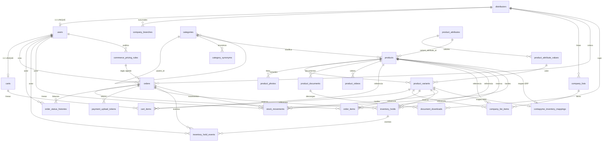

`catalog_banners`, `commerce_tier_advisors` y `contapyme_sync_runs` no tienen
llaves foráneas: son tablas de configuración y de bitácora sin padre.

---

## 2. ER — Catálogo

Producto, su árbol de categorías, el eje de variación y los medios asociados.

*Fuente: `app/Modules/Catalog/Models/`, `app/Modules/Categories/Models/`.*

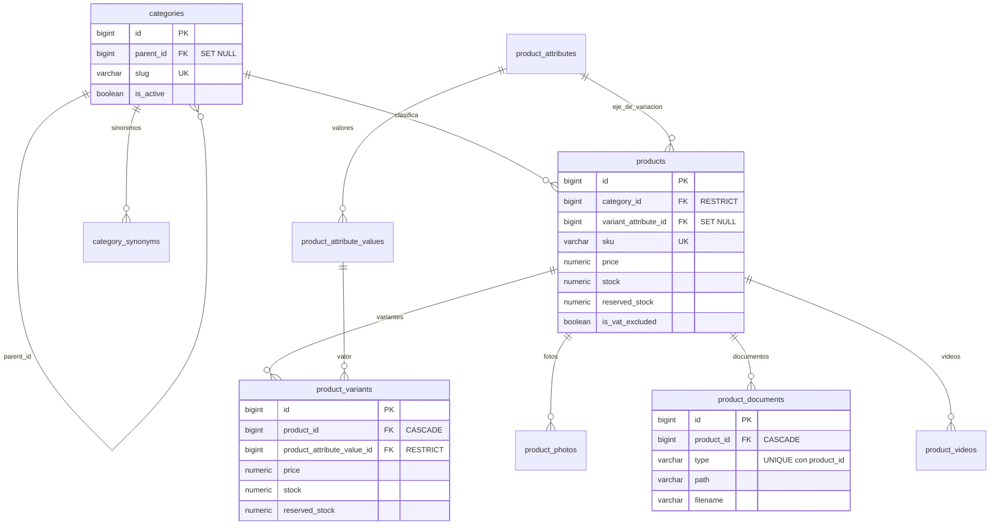

---

## 3. ER — Empresas, carrito y pedidos

El camino comercial completo, del distribuidor a la línea de pedido.

*Fuente: `app/Modules/Company/Models/`, `app/Modules/Orders/Models/`.*

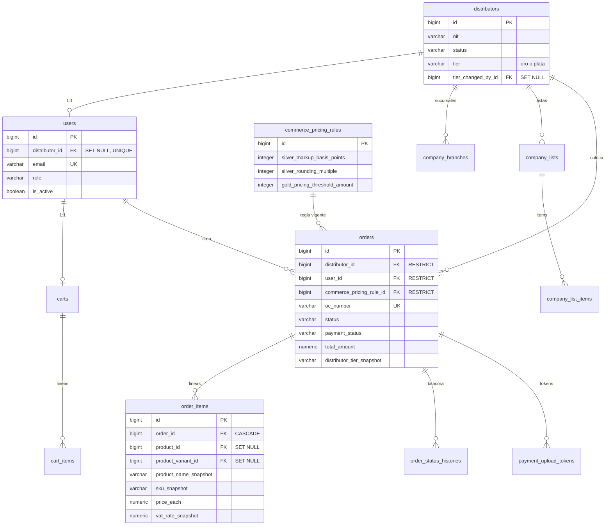

---

## 4. ER — Inventario y ERP

La doble contabilidad: `inventory_holds` audita, `reserved_stock` proyecta.

*Fuente: `app/Modules/Inventory/Models/`, `app/Modules/Orders/Services/OrderInventoryService.php`.*

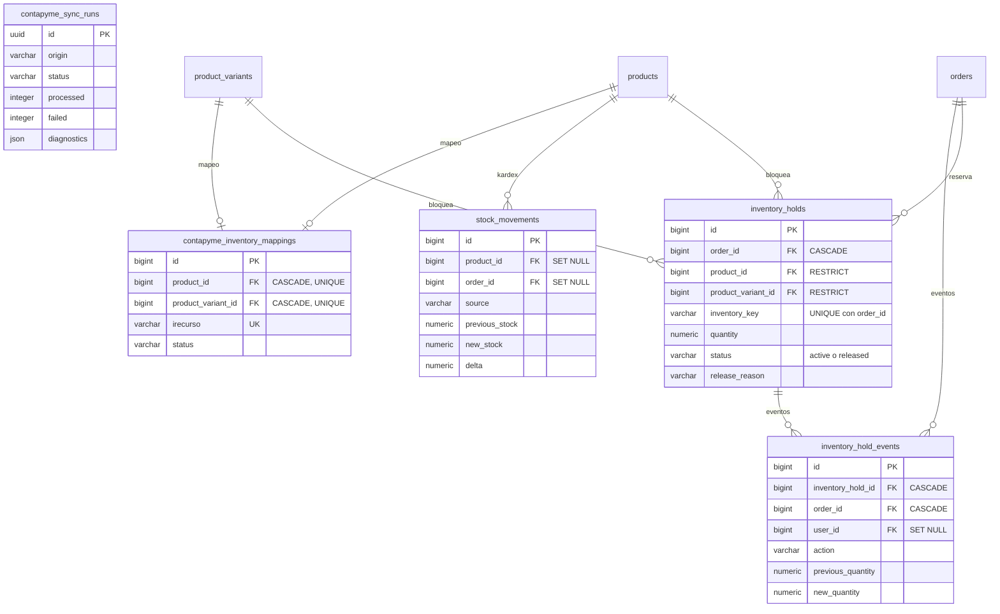

---

## 5. Estados del pedido

Las transiciones son exactamente las de `OrderStatus::nextAllowedStatuses()`.
Ningún camino fuera de este grafo es aceptado por
`OrderStatusTransitionService`, que además bloquea con `lockForUpdate` y
escribe una fila en `order_status_histories` por cada salto.

*Fuente: `app/Modules/Shared/Enums/OrderStatus.php`, `app/Modules/Orders/Services/OrderStatusTransitionService.php`.*

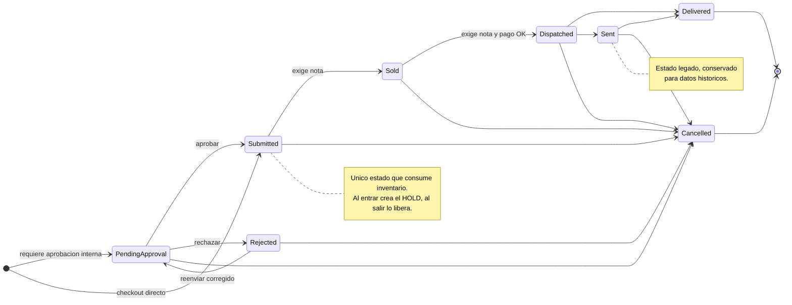

`Draft` existe como valor por defecto de la columna pero no tiene transiciones
salidas definidas; los pedidos nacen en `PendingApproval` o `Submitted`.

---

## 6. Estados del pago manual

Aplica solo cuando el checkout se hizo con intención de pago. Los pedidos sin
pago nacen en `NotApplicable` y ahí se quedan.

*Fuente: `app/Modules/Shared/Enums/PaymentStatus.php`, `app/Modules/Orders/Services/Payment/`.*

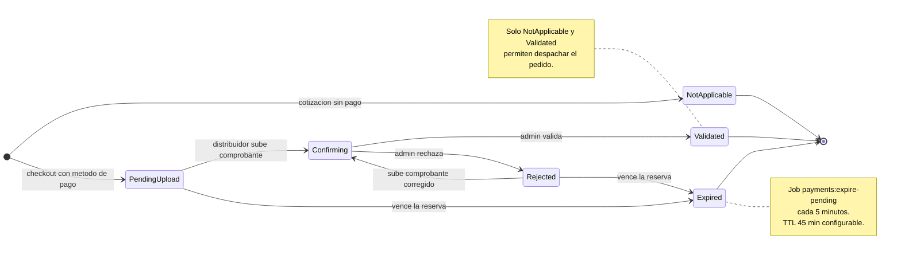

---

## 7. Checkout a cotización enviada

El camino completo desde el POST hasta el correo, incluyendo el encadenamiento
de jobs que impide enviar el correo sin PDF.

*Fuente: `app/Modules/Orders/Actions/CreateOrderAction.php`, `app/Modules/Orders/Listeners/GenerateOrderPdfListener.php`.*

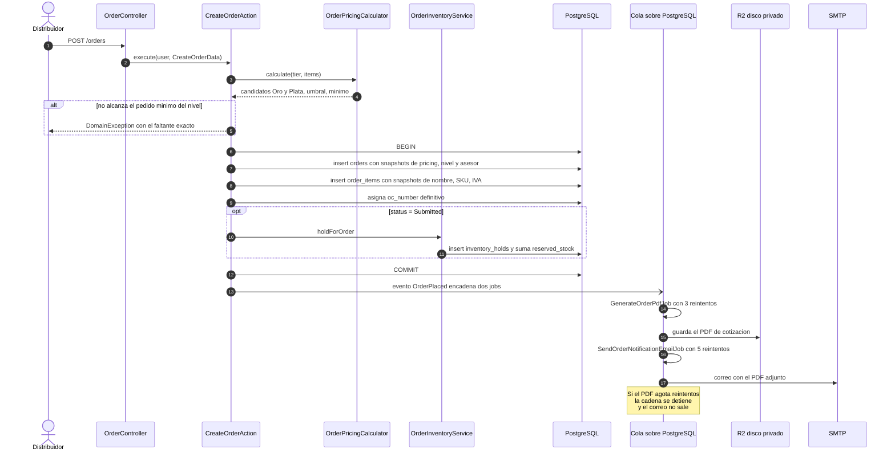

---

## 8. Subida de documento protegido

Mismo camino para ficha técnica, INVIMA, manual, guía rápida y calibración.

*Fuente: `app/Modules/Catalog/Actions/AttachProtectedProductDocumentAction.php`, `app/Modules/Catalog/Security/SafeUploadValidator.php`.*

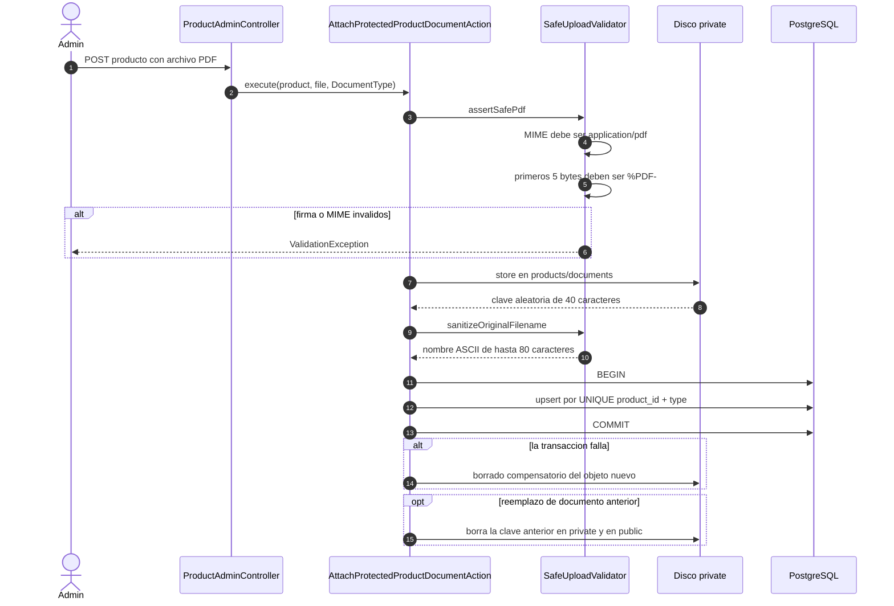

---

## 9. Descarga con autorización y cupo

El archivo nunca se expone con una URL de R2. Se transmite por PHP después de
tres verificaciones independientes.

*Fuente: `app/Modules/Documents/Http/Controllers/TechSheetDownloadController.php`, `app/Modules/Documents/Services/TechSheetDownloadService.php`.*

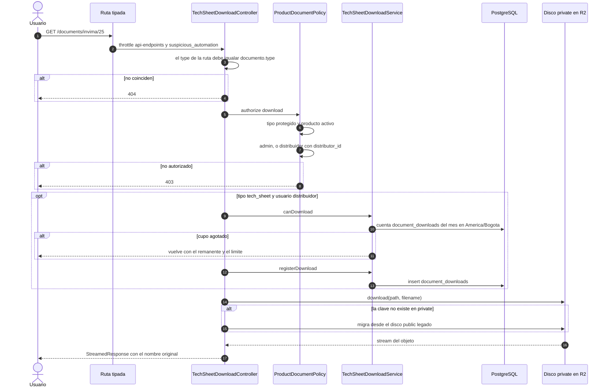

---

## 10. Topología de discos y Cloudflare R2

Dos discos lógicos, dos buckets, dos credenciales y dos estrategias de entrega
distintas.

*Fuente: `config/filesystems.php`, `app/Modules/Shared/Support/PublicMediaUrl.php`.*

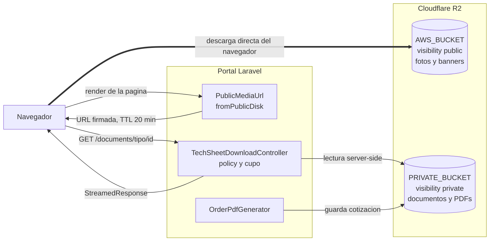

La diferencia importante: la flecha gruesa hacia `AWS_BUCKET` es tráfico que
sale del navegador directo a Cloudflare. Hacia `PRIVATE_BUCKET` no hay ninguna
flecha desde el navegador — todo pasa por PHP.

### Resolución del driver por entorno

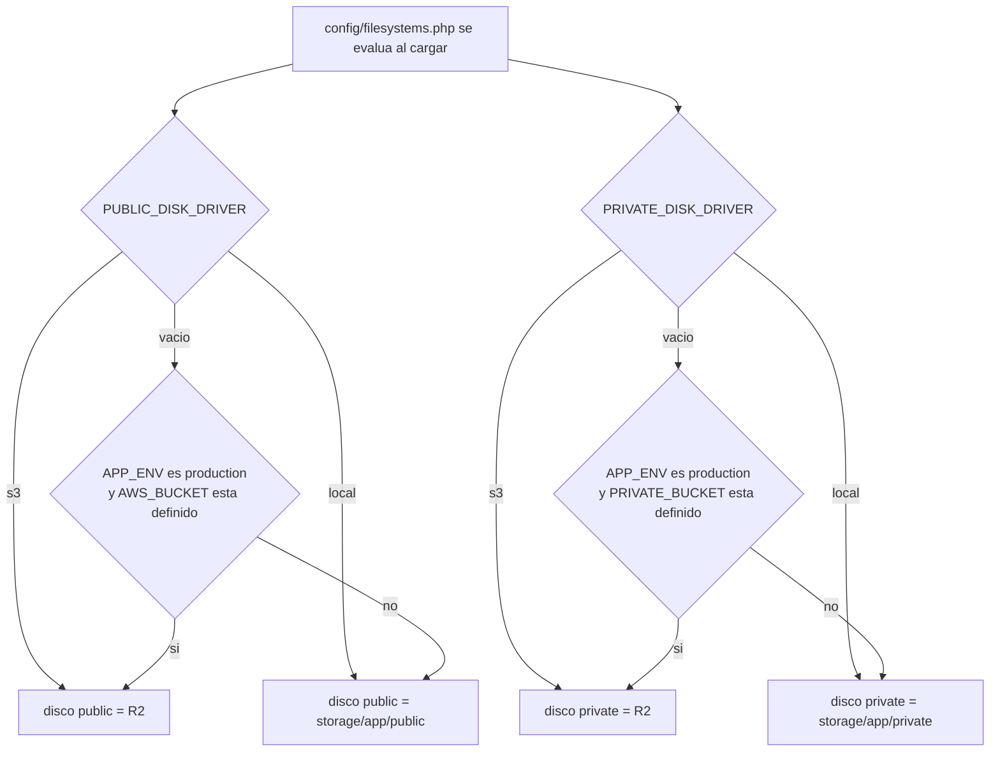

Los tres ajustes propios de R2, en ambos discos: `region = auto`,
`use_path_style_endpoint = true` y
`endpoint = https://ACCOUNT_ID.r2.cloudflarestorage.com`.
